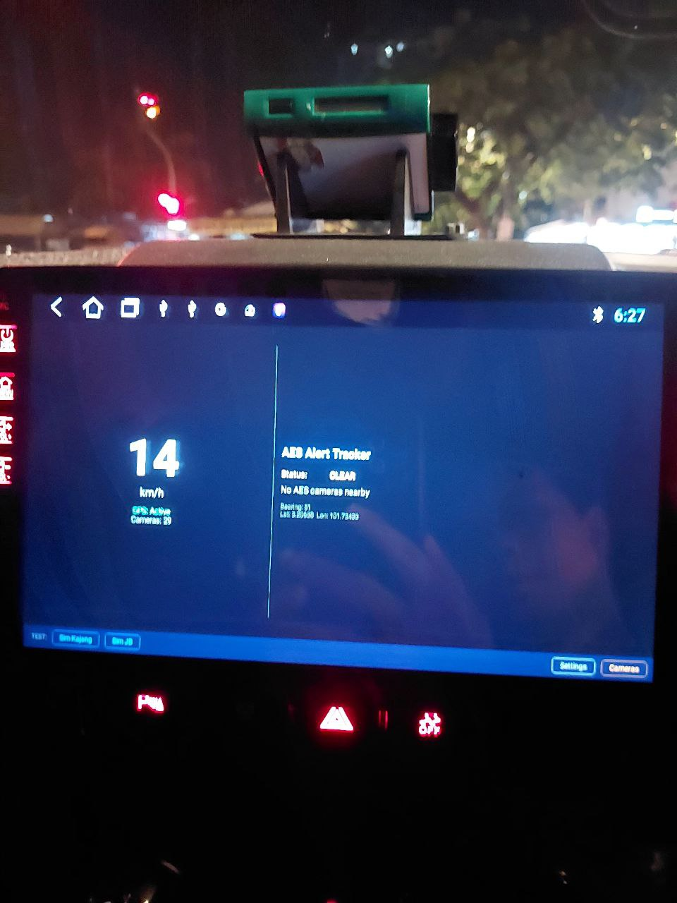
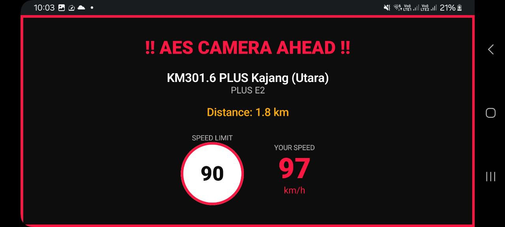
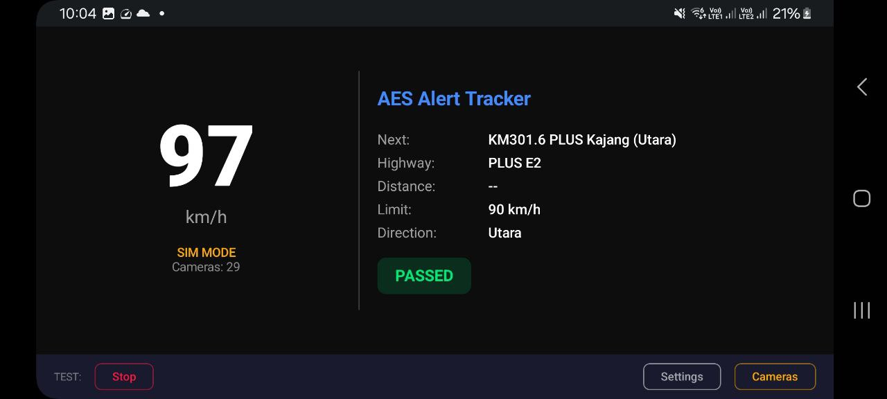

# AES Alert Tracker


Fully offline Android app that warns drivers when approaching AES/AWAS speed enforcement cameras on Malaysian highways. Runs as a persistent foreground GPS service.

---

## Screenshots

| Running on car head unit | Alert overlay |
|:---:|:---:|
|  |  |
| **Dashboard — PASSED state** | **Dashboard — CLEAR (sim mode)** |
|  | .jpg>) |

---

## Features

- Real-time GPS tracking via foreground service
- Proximity detection using Haversine distance + bearing-aware directional filtering
- Full-screen alert overlay when approaching a camera - shows camera name, highway, distance, speed limit vs current speed
- Audio alert: 3-beep sequence on approach, silenced once passing
- Dashboard with large speed readout, GPS lock status, and next camera info
- 29 AES/AWAS cameras across major Malaysian highways and federal routes
- Configurable alert distance (500 m - 5 km)
- In-app camera database browser with edit capability
- Route simulator for testing without driving (Kajang, JB routes)
- Auto-starts on device boot

---

## How It Works

```
GPS location update (every second)
          |
          v
    ProximityEngine
     - Haversine distance to each camera
     - Bearing match: is the user heading toward the camera's monitored direction?
     - Ahead check: is the camera in front, not behind?
          |
          v
    Alert state machine
    CLEAR -> APPROACHING -> PASSING -> PASSED -> (30s cooldown) -> CLEAR
          |
          v
    AlertManager (3-beep audio)  +  AlertOverlay (full-screen visual)
```

An alert only fires when all three conditions are met:
1. Within scan radius
2. Travel direction matches the camera's monitored bearing (within tolerance)
3. Camera is ahead, not already passed

---

## Camera Coverage

| Highway | Cameras | States |
|---------|:-------:|--------|
| PLUS E2 (Southern) | 9 | Johor, Melaka, Selangor |
| PLUS E1 (Northern) | 8 | Perak, Pulau Pinang, Kedah, Selangor |
| ELITE E6 | 2 | Selangor |
| GCE E35 | 2 | Selangor |
| SKVE E26 | 1 | Selangor |
| LEKAS E21 | 2 | Negeri Sembilan |
| Lebuh Sentosa | 1 | WP Putrajaya |
| Federal Route 1 | 1 | Perak |
| Federal Route 8 | 1 | Kelantan |
| LPT2 E8 | 2 | Terengganu |
| **Total** | **29** | |

Sources: JPJ official AES/AWAS list, OpenStreetMap Overpass API, community reports.

---

## Architecture

```
com.aesalert.app/
  |
  +-- data/
  |     AESCamera.kt          Room entity (lat, lng, speed limit, bearing, direction)
  |     CameraDao.kt          Room DAO (CRUD operations)
  |     AESDatabase.kt        Room database with prepopulation on first launch
  |     CameraData.kt         Hardcoded camera seed list (29 cameras)
  |     AppSettings.kt        SharedPreferences wrapper (alert distance setting)
  |
  +-- logic/
  |     ProximityEngine.kt    Core detection: Haversine + bearing match + ahead check
  |     AlertManager.kt       Audio alerts via ToneGenerator (3-beep sequence)
  |     RouteSimulator.kt     Fake GPS routes for testing (Kajang, JB)
  |
  +-- service/
  |     LocationTrackingService.kt   Foreground service, GPS updates, StateFlow emission
  |
  +-- ui/
  |     MainScreen.kt         Dashboard — speed display, GPS status, camera info
  |     AlertOverlay.kt       Full-screen warning overlay (APPROACHING state)
  |     CameraListScreen.kt   View and edit camera database
  |     SettingsDialog.kt     Alert distance configuration
  |     theme/Theme.kt        Dark theme (Material 3)
  |
  +-- MainActivity.kt         Entry point, runtime permissions, service binding
  +-- BootReceiver.kt         BroadcastReceiver — auto-start service on boot
```

---

## Tech Stack

| | |
|---|---|
| Language | Kotlin |
| UI | Jetpack Compose + Material 3 |
| Database | Room (SQLite) |
| Concurrency | Kotlin Coroutines + StateFlow |
| Build | Gradle Kotlin DSL, KSP |
| Min SDK | 26 (Android 8.0 Oreo) |
| Target SDK | 35 |

---

## Installation

Download the latest APK from the [Releases](https://github.com/syedabdhalim/aes-alert/releases) tab.

1. Transfer the APK to your Android device via USB or any storage
2. On your device: **Settings > Security > Unknown Sources** (or **Install unknown apps**) — enable for your file manager
3. Open the APK with your file manager and install
4. Grant location permissions when prompted

> Tested on Android car head units and tablets (Android 8.0+)

---

## Build from Source

```bash
# Debug APK
./gradlew assembleDebug

# Install directly to connected device
./gradlew installDebug

# Release APK (minified + obfuscated)
./gradlew assembleRelease
```

Requires Android Studio with Android SDK 35.

---

## Permissions

| Permission | Purpose |
|------------|---------|
| `ACCESS_FINE_LOCATION` | Precise GPS tracking |
| `ACCESS_BACKGROUND_LOCATION` | Continue tracking when screen is off |
| `FOREGROUND_SERVICE` | Persistent GPS service |
| `FOREGROUND_SERVICE_LOCATION` | Location-type foreground service (Android 14+) |
| `POST_NOTIFICATIONS` | Foreground service notification (Android 13+) |
| `RECEIVE_BOOT_COMPLETED` | Auto-start service on device boot |
| `WAKE_LOCK` | Keep CPU active while service is running |

---

## Disclaimer

This app is for informational purposes only. It is the driver's sole responsibility to obey all traffic laws and speed limits at all times.

Speed displayed is GPS-derived and may differ from your vehicle's speedometer. This is normal - most speedometers are calibrated to read slightly higher than actual speed by design.

